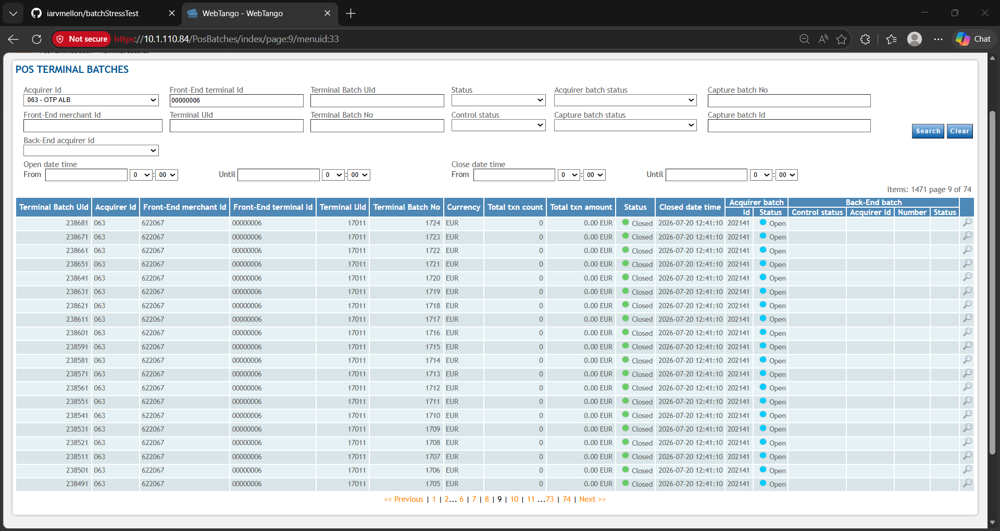
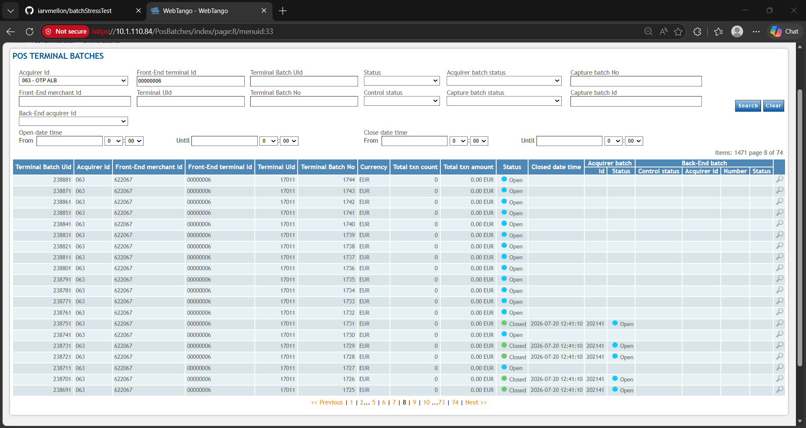
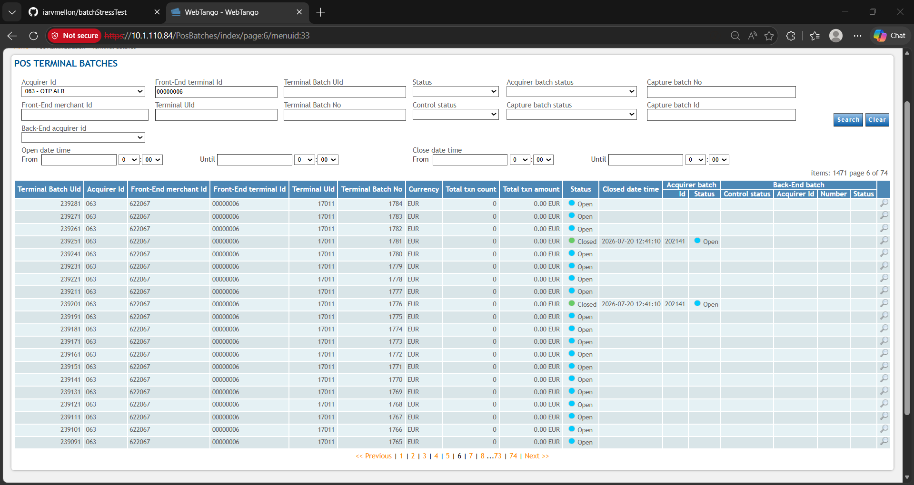

# Batch Closing Stress Test Report

## Test objective

The test evaluated the behavior of the payment terminal when a large number
of sales and CLOSE BATCH requests are sent in a short period of time.

## Sales phase

- **Total sales:** 355
- **Batch assignment:** one different batch number per sale
- **Expected result:** 355 distinct batches were created and all were ready to
  be closed independently.

## Batch-closing phase

After the sales completed, all CLOSE BATCH requests were dispatched together,
without a delay between requests. This produced a burst of traffic and caused
an SPDH flooding condition at the TANGO endpoint.

## Observed behavior

Initially, all CLOSE BATCH requests shown on Page 9 were processed
successfully. The problem first appears on Page 8 and remains visible on Pages
6 and 5. On Pages 1–4, the system was unable to complete any CLOSE BATCH
operation.

## Progressive observations

The report pages are listed below in chronological order of the observed
behavior:

- [Page 9 — all CLOSE BATCH operations successful](#page-9--all-close-batch-operations-successful)
- [Page 8 — problem begins](#page-8--problem-begins)
- [Pages 6 and 5 — problem continues](#pages-6-and-5--problem-continues)
- [Pages 1–4 — no CLOSE BATCH completed](#pages-14--no-close-batch-completed)

### Page 9 — all CLOSE BATCH operations successful

All CLOSE BATCH operations shown on Page 9 were completed successfully.

*Page 9 — successful CLOSE BATCH operations before the problem appears.*

### Page 8 — problem begins

The problem first becomes visible on Page 8. From this point, the endpoint
begins showing signs of overload and CLOSE BATCH processing becomes unreliable.

*Page 8 — the first visible CLOSE BATCH problem.*

### Pages 6 and 5 — problem continues

The CLOSE BATCH problem remains present on Pages 6 and 5.

*Page 6 — unsuccessful or incomplete CLOSE BATCH processing continues.*

*Page 5 — the CLOSE BATCH problem remains visible.*

### Pages 1–4 — no CLOSE BATCH completed

On Pages 1–4, the system was unable to complete any CLOSE BATCH operation.

## Conclusion

Sending hundreds of CLOSE BATCH requests concurrently is not reliable for this
endpoint. Although the CLOSE BATCH operations on Page 9 succeeded, failures
started appearing on Page 8, continued on Pages 6 and 5, and eventually no
batches were closed on Pages 1–4. This behavior is consistent with request
flooding or device overload rather than a payload-generation problem.

## Recommended execution mode

CLOSE BATCH requests should be sent sequentially with a delay between them.
This avoids flooding the endpoint and allows each response to be received before
the next request is transmitted.

## Pending transaction handling

Each pending SALE in `sales_transmitted.json` is identified by the combination
of its `tid` and `sequence_number`. The application removes exactly one
matching entry only after its CLOSE BATCH receives a successful response code
(`000` or `001`).

If CLOSE BATCH returns another response code, times out, or encounters a socket
error, the SALE is not removed. It remains pending in `sales_transmitted.json`
and can be retried after the endpoint has recovered. Matching on both fields is
important because different TIDs can use the same sequence number; therefore,
a successful CLOSE for one TID must not delete a failed pending SALE belonging
to another TID.
